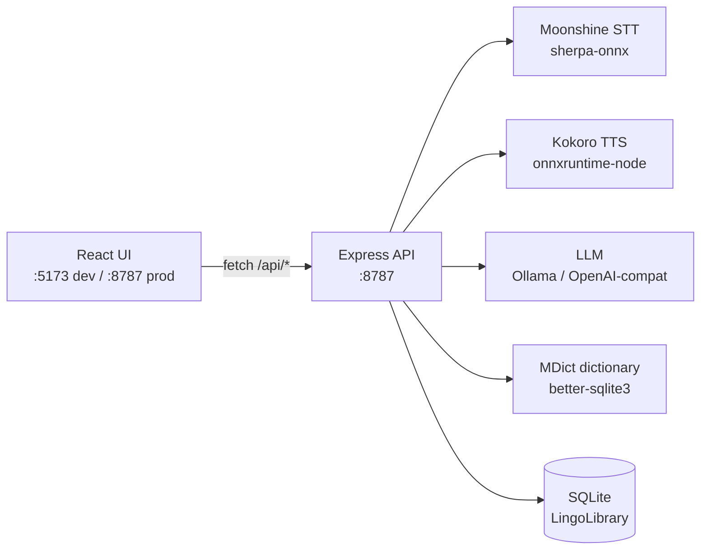

# Lingutribe


**Local-first language-learning workstation for English.** Offline speech recognition,
text-to-speech, an offline dictionary, and an optional AI tutor — in one desktop app.
Your audio, texts, and word lists stay on your Mac; only the LLM features need the network.

---

## What it does

| Need | How Lingutribe helps |
|------|----------------------|
| Understand audio / video | Local STT transcribes it; word-level waveform with split / speed / space-to-play |
| Can't read a word aloud | Local Kokoro TTS reads any sentence; fully offline |
| Unknown word | Offline MDict dictionary, with an LLM fallback for explanations |
| No one to ask / correct | An AI tutor (Ollama or any OpenAI-compatible endpoint) |
| Too many tools | Resources · Read · Dictionary · Words · Chat in one place |

Everything that can run locally **does** — only optional LLM calls leave the machine.

---

## Quick start (from source)

```bash
git clone https://github.com/veritasian/lingutribe.git
cd lingutribe
npm install

npm run dev      # UI at http://localhost:5173, API at http://localhost:8787
# or run the desktop shell (Electron):
npm run app
```

Open **http://localhost:5173** in dev, or **http://localhost:8787** in production / packaged mode.

### Build the desktop app (.dmg)

```bash
npm run dist:mac     # → dist-electron/Lingutribe-0.1.0-arm64.dmg
```

Requires Xcode Command Line Tools. The current local build is **unsigned**; on a clean
Mac, Gatekeeper blocks the first launch, so run once:

```bash
xattr -dr com.apple.quarantine /Applications/Lingutribe.app
```

(A Developer ID + notarization can be enabled in the `build` block of `package.json`.)

---

## Architecture



In the packaged app the server is pre-compiled (`dist-server/index.mjs`) and runs **inside**
the Electron main process on a single port (`:8787`) — no separate service to manage.

---

## Engines & configuration

All engines are configured in **Settings → Engines** and persisted locally (SQLite).

| Engine | Options | Notes |
|--------|---------|-------|
| **STT** | local Moonshine (auto-model) | offline; model downloads on first use |
| **TTS** | local Kokoro, or OpenAI-compatible | Kokoro is fully offline; OpenAI-compatible needs a key |
| **LLM** | Ollama (`http://localhost:11434`), or any OpenAI-compatible base URL | user-supplied key, stored only in local SQLite |

Library data lives at `~/Documents/LingoLibrary` by default (word lists, notes, TTS cache)
and is created automatically.

---

## Models install automatically

The app starts immediately after `npm install` — **no model download required**. ML models
download on first use, then stay cached for fully offline use:

| Purpose | Engine | Size |
|---------|--------|------|
| Speech recognition (STT) | Moonshine `tiny-en-int8` (sherpa-onnx) | ≈75 MB |
| Speech synthesis (TTS) | Kokoro `82m-v1.0-quantized` | ≈88 MB |
| TTS voice pack | Kokoro voices | ≈27 MB |

Pre-deploy from **Settings → Engines → Deploy** if you want models ready ahead of time.

---

## API surface (all under `/api`)

| Group | Endpoints |
|-------|----------|
| Health | `GET /api/health` |
| Settings | `GET /api/settings`, `PUT /api/settings`, `GET /api/disk` |
| Resources | `GET/POST /api/resources`, `POST /api/resources/:id/transcribe` |
| Words / Notes | `GET/POST /api/words`, `GET/POST /api/notes` |
| Chat | `GET/POST /api/chat` |
| Dictionary | `GET /api/dict/list`, `GET /api/dict/lookup`, `POST /api/dict/llm` |
| Engines (self-test) | `POST /api/engines/stt/test`, `/tts/test`, `/llm/test` |
| STT / TTS / LLM | `POST /api/stt/transcribe`, `POST /api/tts/synthesize`, `GET /api/tts/voices`, `POST /api/llm/chat` |
| Models | `POST /api/models/ensure`, `POST /api/models/ensure-kokoro` |
| Import | `POST /api/import`, `POST /api/import/text` |

---

## Project layout

```
lingutribe/
├── src/
│   ├── server/                 # Express engine (runs on :8787)
│   │   ├── index.ts            # entry: boots Express, registers routes
│   │   ├── engines/            # stt.ts (Moonshine) · tts.ts (Kokoro) · llm.ts · http.ts
│   │   ├── routes/             # thin HTTP layer (resources, words, notes, chat, dict, engines…)
│   │   ├── db.ts               # SQLite + library paths
│   │   └── analysis.ts         # media analysis (duration, waveform, segments)
│   ├── web/                    # React UI (Vite root)
│   │   ├── components/         # PlayerView, Transcript, WordPanel, WaveformPlayer…
│   │   ├── pages/              # Resources, Read, Words, Chat, Notes, Settings
│   │   └── api.ts              # the HTTP contract (fetch wrappers + types)
│   └── shared/                 # legacy shared types
├── electron/main.cjs           # desktop shell: spawns dev server or imports dist-server
├── data/                       # gitignored: coca-bands.json + model cache
├── docs/                       # user manual (zh)
├── vite.config.ts              # Vite root = src/web; proxies /api → :8787
├── tailwind.config.js · postcss.config.js
└── package.json                # deps + scripts + electron-builder config
```

The UI and engine are decoupled by an **HTTP contract only** (`fetch('/api/...')`, never a
hard-coded host), so the same code runs in dev, in production, and inside the packaged app.

---

## License

This unified repository bundles the engine and the UI. See [`LICENSE`](LICENSE) — the
application is proprietary and not open source.
