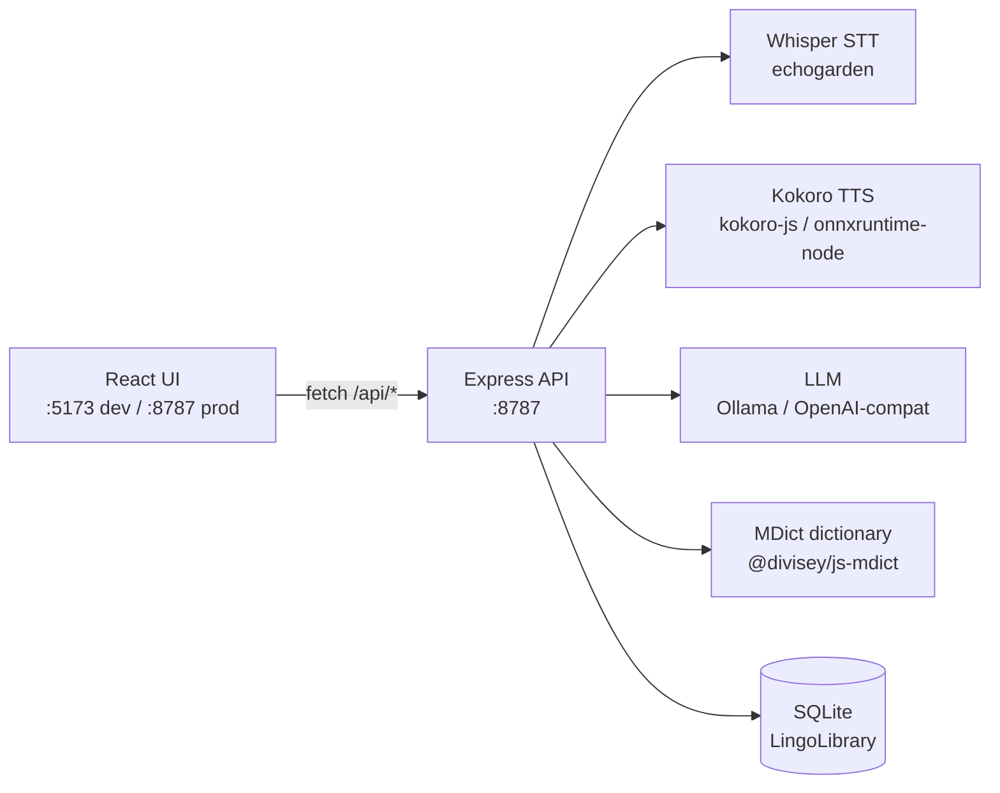

# Lingutribe


**Local-first English learning workstation** — offline speech recognition, text-to-speech,
offline dictionaries, vocabulary analytics and notes, in one desktop app. Your audio, texts,
word lists and notes stay on your Mac; only the optional AI tutor needs the network.

> 中文说明见 [README.zh-CN.md](README.zh-CN.md) · Chinese version below.

---

## What it does

| Need | How Lingutribe helps |
|------|----------------------|
| Understand audio / video | Local Whisper STT transcribes it; word-level waveform with split / speed / space-to-play |
| Can't read a word aloud | Local Kokoro TTS reads any sentence; fully offline |
| Unknown word | Offline MDict dictionary (drop in `.mdx`/`.mdd` files) with an LLM fallback |
| Which words matter | COCA word bands highlight every word's frequency (1k–6k+) as you read |
| Capture thoughts while learning | Apple-Notes-style notes, inline editor in the player and reader, auto-saved |
| No one to ask / correct | An AI tutor (Ollama or any OpenAI-compatible endpoint) |
| Too many tools | Audio · Video · Read · Dictionary · Words · Notes · Chat in one place |

Everything that can run locally **does** — only optional LLM calls leave the machine.

---

## Quick start (from source)

```bash
git clone https://github.com/veritasian/lingutribe.git
cd lingutribe
npm install

npm run dev      # UI at http://localhost:5173, API at http://localhost:8787
# or run the desktop shell (Electron):
npm run app
```

Open **http://localhost:5173** in dev, or **http://localhost:8787** in production / packaged mode.

### Build the desktop app (.dmg)

```bash
npm run dist:mac     # → dist-electron/Lingutribe-0.1.2-arm64.dmg
```

Requires Xcode Command Line Tools. The build is **unsigned**; on a clean Mac, Gatekeeper
blocks the first launch, so run once:

```bash
xattr -dr com.apple.quarantine /Applications/Lingutribe.app
```

(A Developer ID + notarization can be enabled in the `build` block of `package.json`.)

---

## Features

- **Local STT** — Whisper via echogarden (`tiny`/`base`/`small`/`medium`/`large`), word-level
  timestamps, waveform, speed control, subtitle segmentation tuned for clean captions.
- **Local TTS** — Kokoro (`kokoro-js`) with 40+ voices, fully offline; OpenAI-compatible TTS as
  an alternative.
- **Offline dictionaries** — drop `.mdx`/`.mdd` files into the dictionary folder; pick which
  dictionary interprets a word when several are installed; pronunciation audio from the `.mdd`.
- **COCA word bands** — every word is tagged with its BNC/COCA frequency band (Nation & Crabbe
  headword list, 10k) and highlighted while you read or watch.
- **Notes** — Apple-Notes-style list + editor, Markdown body, auto-saved; open an inline note
  editor directly in the audio/video player and the reader, linked to the resource.
- **AI tutor** — Ask-AI panel and per-resource chat history; Ollama or any OpenAI-compatible
  endpoint; grammar analysis and LLM dictionary fallback.
- **100% local data** — SQLite (`lingo.db`) plus a flat-file library; nothing is uploaded.

---

## Architecture



In the packaged app the server is pre-compiled (`dist-server/index.mjs`) and runs **inside**
the Electron main process on a single port (`:8787`) — no separate service to manage.

---

## Engines & configuration

Configured in **Settings** and persisted locally (SQLite).

| Engine | Options | Notes |
|--------|---------|-------|
| **STT** | Whisper `tiny`/`base`/`small`/`medium`/`large` | offline; model downloads on first use |
| **TTS** | Kokoro (offline, 40+ voices), or OpenAI-compatible | Kokoro is fully offline |
| **LLM** | Ollama (`http://localhost:11434`), or any OpenAI-compatible base URL | user-supplied key, stored only in local SQLite |

Your library lives at `~/Documents/LingoLibrary` by default (SQLite DB, media, dictionaries,
TTS cache) and is created automatically.

### Dictionaries

Drop `.mdx` (and companion `.mdd`) files into the dictionaries folder:

- Default path: `~/Documents/LingoLibrary/dictionaries`
- Settings → Dictionary lists installed dictionaries and lets you choose the **active** one
  (Auto = first dictionary that contains the word).
- Works fully offline — no cloud needed for word lookup.
- Pronunciation audio is served from the `.mdd` resource file.

### Notes

- Markdown body, stored in SQLite, listed by creation time (newest first).
- The notebook button in the audio/video player and the reader opens an inline editor that
  auto-saves and syncs into the Notes list.

### Word bands (COCA)

A bundled `data/coca-bands.json` (10,006 headwords, Nation & Crabbe BNC/COCA) tags words with
frequency bands — `1k`, `3k`, `5k`, `6k`, `above` — highlighted inline and analyzed per article.

---

## Models install automatically

The app starts immediately after `npm install` — **no model download required**. ML models
download on first use, then stay cached for fully offline use. Pre-deploy them from
**Settings → Engines → Deploy** if you want them ready ahead of time.

---

## API surface (all under `/api`)

| Group | Endpoints |
|-------|----------|
| Health | `GET /api/health` |
| Settings | `GET /api/settings`, `PUT /api/settings`, `GET /api/disk` |
| Resources | `GET/POST /api/resources`, `GET /api/resources/:id/analysis`, `POST /api/resources/:id/transcribe`, `POST /api/resources/:id/align` |
| Words | `GET/POST /api/words`, `PUT/DELETE /api/words/:id` |
| Notes | `GET/POST /api/notes` (`?resourceId=` filter), `PUT/DELETE /api/notes/:id` |
| Dictionary | `GET /api/dict/list`, `GET /api/dict/lookup?word=&dict=`, `GET /api/dict/audio?ref=`, `POST /api/dict/llm` |
| Chat | `GET/POST /api/chat` (per-thread history), `DELETE /api/chat/:id` |
| Engines (self-test) | `POST /api/engines/stt/test`, `/tts/test`, `/llm/test` |
| STT / TTS / LLM | `POST /api/stt/transcribe`, `POST /api/tts/synthesize`, `GET /api/tts/voices`, `POST /api/llm/analyze`, `POST /api/llm/chat` |
| Models | `POST /api/models/ensure`, `POST /api/models/ensure-kokoro` |
| Import | `POST /api/import`, `POST /api/import/text` |
| System | `POST /api/system/reveal` |

---

## Project layout

```
lingutribe/
├── src/
│   ├── server/                 # Express engine (runs on :8787)
│   │   ├── index.ts            # entry: boots Express, registers routes, CORS guard
│   │   ├── engines/            # stt.ts (Whisper/echogarden) · tts.ts (Kokoro) · llm.ts · models.ts
│   │   ├── routes/             # resources, words, notes, chat, dict, engines, import, settings
│   │   ├── db.ts               # SQLite + library paths
│   │   └── analysis.ts         # media analysis (duration, waveform peaks, segments)
│   ├── web/                    # React UI (Vite root)
│   │   ├── components/         # PlayerView, Transcript, WordPanel, NoteEditor, WaveformPlayer…
│   │   ├── pages/              # Resources, Read, Words, Notes, Chat, Settings
│   │   └── api.ts              # the HTTP contract (fetch wrappers + types)
│   └── shared/                 # shared types
├── electron/main.cjs           # desktop shell: spawns dev server or imports dist-server
├── data/                       # gitignored: coca-bands.json + model cache
├── lingutribe-docs/            # user manual (zh)
├── vite.config.ts              # Vite root = src/web; proxies /api → :8787
├── tailwind.config.js · postcss.config.js
└── package.json                # deps + scripts + electron-builder config
```

The UI and engine are decoupled by an **HTTP contract only** (`fetch('/api/...')`, never a
hard-coded host), so the same code runs in dev, in production, and inside the packaged app.

---

## License

Lingutribe is licensed under the **Apache License 2.0** — see [`LICENSE`](LICENSE).
