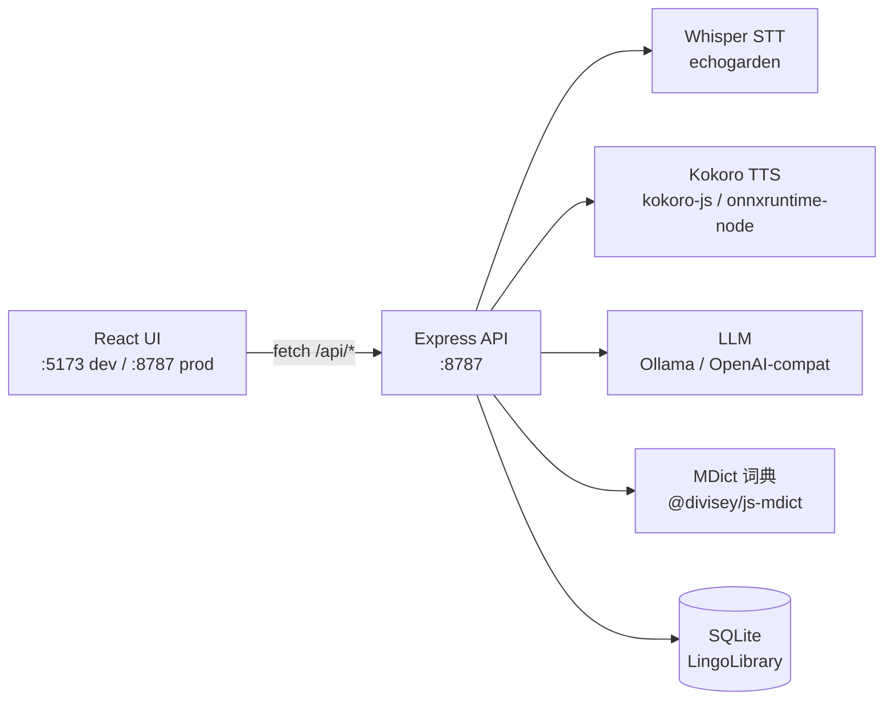

# Lingutribe


**本地优先的英语学习工作站** —— 离线语音识别、离线朗读、离线词典、词汇分析与笔记，一个桌面应用搞定。
你的音频、文本、单词本和笔记始终留在 Mac 上；只有可选的 AI 助教需要联网。

> English version: [README.md](README.md)

---

## 它能做什么

| 需求 | Lingutribe 怎么帮 |
|------|-------------------|
| 听懂音频 / 视频 | 本地 Whisper 转写；词级波形，支持分割、变速、空格播放 |
| 单词不知道怎么读 | 本地 Kokoro TTS 朗读任意句子；完全离线 |
| 生词 | 离线 MDict 词典（放入 `.mdx`/`.mdd` 即用），可接 LLM 兜底解释 |
| 哪些词值得背 | COCA 词频带（1k–6k+）随读随标 |
| 边学边记 | Apple Notes 式笔记，播放器/阅读器内联编辑器，自动保存 |
| 没人可问 | AI 助教（Ollama 或任意 OpenAI 兼容端点） |
| 工具太多 | 音频 · 视频 · 阅读 · 词典 · 单词 · 笔记 · 对话，一处搞定 |

凡是能本地跑的都**在本地跑** —— 只有可选的 LLM 调用才离开你的电脑。

---

## 快速开始（源码）

```bash
git clone https://github.com/veritasian/lingutribe.git
cd lingutribe
npm install

npm run dev      # UI: http://localhost:5173，API: http://localhost:8787
# 或直接跑桌面版（Electron）：
npm run app
```

开发环境打开 **http://localhost:5173**；生产 / 打包版打开 **http://localhost:8787**。

### 打包桌面应用（.dmg）

```bash
npm run dist:mac     # → dist-electron/Lingutribe-0.1.2-arm64.dmg
```

需要 Xcode Command Line Tools。当前构建**未签名**；新 Mac 上 Gatekeeper 会拦首次打开，执行一次：

```bash
xattr -dr com.apple.quarantine /Applications/Lingutribe.app
```

（如需正式分发，可在 `package.json` 的 `build` 块配置 Developer ID + 公证。）

---

## 功能

- **本地语音识别** —— Whisper（echogarden 引擎），模型 `tiny`/`base`/`small`/`medium`/`large`，
  词级时间戳、波形、变速、针对字幕优化的断句。
- **本地朗读** —— Kokoro（`kokoro-js`）40+ 音色，完全离线；也支持 OpenAI 兼容的 TTS。
- **离线词典** —— 把 `.mdx`/`.mdd` 放进词典目录即可；装了多本词典时可选**用哪本来解读**；
  发音音频从 `.mdd` 里读取。
- **COCA 词频带** —— 每个词标注 BNC/COCA 词频段（Nation & Crabbe 头词表，1 万词），
  阅读/观看时高亮。
- **笔记** —— Apple Notes 风格列表 + 编辑器，Markdown 正文，自动保存；播放器与阅读器内
  联笔记与资源绑定。
- **AI 助教** —— Ask-AI 面板 + 按资源分线程的对话历史；Ollama 或任意 OpenAI 兼容端点；
  语法分析、词典兜底。
- **数据 100% 本地** —— SQLite（`lingo.db`）+ 文件库；不上传任何东西。

---

## 架构



打包版中，服务端预编译为 `dist-server/index.mjs` 并**直接跑在 Electron 主进程里**（单端口 `:8787`），
无需单独管理服务进程。

---

## 引擎与配置

在「设置」里配置，全部本地持久化（SQLite）。

| 引擎 | 选项 | 说明 |
|------|------|------|
| **STT** | Whisper `tiny`/`base`/`small`/`medium`/`large` | 离线；模型首次使用时下载 |
| **TTS** | Kokoro（离线，40+ 音色），或 OpenAI 兼容 | Kokoro 完全离线 |
| **LLM** | Ollama（`http://localhost:11434`），或任意 OpenAI 兼容 base URL | 密钥只存在本地 SQLite |

默认资料库在 `~/Documents/LingoLibrary`（SQLite、媒体、词典、TTS 缓存），自动创建。

### 词典

把 `.mdx`（及配套 `.mdd`）放进词典目录：

- 默认路径：`~/Documents/LingoLibrary/dictionaries`
- 设置 → 词典 会列出已安装词典，并可选择**当前使用哪本**（Auto = 第一个能查到该词的词典）。
- 完全离线查词，无需联网；发音音频从 `.mdd` 读取。

### 笔记

- Markdown 正文，存 SQLite，按创建时间倒序。
- 播放器 / 阅读器顶部的笔记本按钮打开内联编辑器，自动保存并同步到笔记列表。

### COCA 词频

内置 `data/coca-bands.json`（10,006 个词头，Nation & Crabbe BNC/COCA），把词标成
`1k` / `3k` / `5k` / `6k` / `above` 频段，随文高亮并按文章统计。

---

## 模型自动安装

`npm install` 后即可启动 —— **无需手动下载模型**。ML 模型首次使用时下载，之后本地缓存、
完全离线。想提前备好可在「设置 → 引擎 → 部署」里预下载。

---

## API 一览（全部在 `/api` 下）

| 分组 | 端点 |
|------|------|
| 健康 | `GET /api/health` |
| 设置 | `GET /api/settings`, `PUT /api/settings`, `GET /api/disk` |
| 资源 | `GET/POST /api/resources`, `GET /api/resources/:id/analysis`, `POST /api/resources/:id/transcribe`, `POST /api/resources/:id/align` |
| 单词 | `GET/POST /api/words`, `PUT/DELETE /api/words/:id` |
| 笔记 | `GET/POST /api/notes`（支持 `?resourceId=` 过滤）, `PUT/DELETE /api/notes/:id` |
| 词典 | `GET /api/dict/list`, `GET /api/dict/lookup?word=&dict=`, `GET /api/dict/audio?ref=`, `POST /api/dict/llm` |
| 对话 | `GET/POST /api/chat`（按线程）, `DELETE /api/chat/:id` |
| 引擎自测 | `POST /api/engines/stt/test`, `/tts/test`, `/llm/test` |
| STT / TTS / LLM | `POST /api/stt/transcribe`, `POST /api/tts/synthesize`, `GET /api/tts/voices`, `POST /api/llm/analyze`, `POST /api/llm/chat` |
| 模型 | `POST /api/models/ensure`, `POST /api/models/ensure-kokoro` |
| 导入 | `POST /api/import`, `POST /api/import/text` |
| 系统 | `POST /api/system/reveal` |

---

## 目录结构

```
lingutribe/
├── src/
│   ├── server/                 # Express 引擎（:8787）
│   │   ├── index.ts            # 入口：启动 Express、注册路由、CORS 防护
│   │   ├── engines/            # stt.ts（Whisper/echogarden）· tts.ts（Kokoro）· llm.ts · models.ts
│   │   ├── routes/             # resources, words, notes, chat, dict, engines, import, settings
│   │   ├── db.ts               # SQLite + 资料库路径
│   │   └── analysis.ts         # 媒体分析（时长、波形峰值、分段）
│   ├── web/                    # React UI（Vite 根目录）
│   │   ├── components/         # PlayerView, Transcript, WordPanel, NoteEditor, WaveformPlayer…
│   │   ├── pages/              # Resources, Read, Words, Notes, Chat, Settings
│   │   └── api.ts              # HTTP 契约（fetch 封装 + 类型）
│   └── shared/                 # 共享类型
├── electron/main.cjs           # 桌面壳：开发时拉起 dev server，打包后 import dist-server
├── data/                       # gitignored：coca-bands.json + 模型缓存
├── lingutribe-docs/            # 架构文档 + 用户手册（zh）
├── vite.config.ts              # Vite 根目录 = src/web；/api → :8787 代理
├── tailwind.config.js · postcss.config.js
└── package.json                # 依赖 + 脚本 + electron-builder 配置
```

UI 与引擎只通过 **HTTP 契约**解耦（`fetch('/api/...')`，不写死主机），因此同一套代码
在开发、生产、打包版里运行一致。

---

## 许可证

专有软件 —— 见 [`LICENSE`](LICENSE)。本 UI 仓库**不是开源的**；未经书面许可不得复制、
修改或分发。
