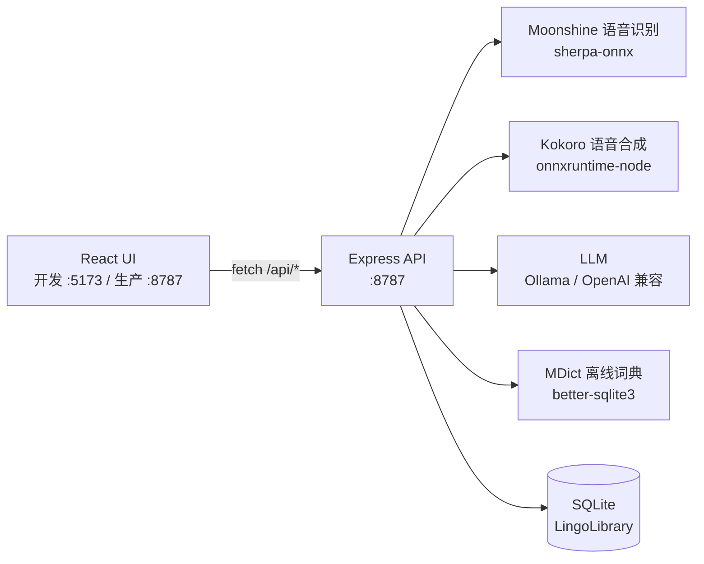

# Lingutribe


> **本地优先的英语学习工作台。** 离线语音识别、文本转语音、离线词典，以及可选的 AI 导师——全部集成在一个桌面应用里。音频、文本、单词列表都留在你的 Mac 上；只有你主动开启的 LLM 功能才联网。

---

## 📦 v0.1.0 — 桌面预览版（macOS arm64）

首个打包的 **macOS（Apple 芯片）** 桌面安装包，用于测试的预览版。

- 把完整的本地功能栈（语音识别、语音合成、离线词典）打包进一个 `.dmg`。
- 当前安装包**未签名**：在干净的 Mac 上 Gatekeeper 会拦截首次打开，请右键点击 App 选择「打开」，或执行一次：
  ```bash
  xattr -dr com.apple.quarantine /Applications/Lingutribe.app
  ```
- 后续版本会提供 Developer ID 签名与公证。

> 📥 在 GitHub Releases 下载 `Lingutribe-0.1.0-arm64.dmg`，或本地 `npm run dist:mac` 自行打包。

---

## 它能做什么

| 学习痛点 | Lingutribe 怎么做 |
|----------|-------------------|
| 听不懂音频 / 视频 | 本地 STT 自动转写，配词级波形，可拆分、变速、空格播放 |
| 不会读、发音没反馈 | 本地 Kokoro TTS，点句子即朗读，完全离线 |
| 生词不认识 | 离线 MDict 词典 + AI 兜底解释 |
| 没人答疑 / 纠音 | 可接 Ollama 或 OpenAI 兼容接口的 AI 导师 |
| 隐私顾虑、不想数据上云 | 核心功能全本地；只有你配置的 LLM 才联网 |
| 工具太多、来回切 | 资源 / 阅读 / 词典 / 单词 / 对话一处搞定 |

凡是能本地跑的都本地跑，只有可选的 LLM 功能需要联网。

---

## 快速开始（从源码）

```bash
git clone https://github.com/veritasian/lingutribe.git
cd lingutribe
npm install

npm run dev      # UI 在 :5173，API 在 :8787
# 或启动桌面端（Electron）：
npm run app
```

开发模式打开 **http://localhost:5173**，生产 / 打包模式打开 **http://localhost:8787**。

### 打包桌面安装包（.dmg）

```bash
npm run dist:mac     # → dist-electron/Lingutribe-0.1.0-arm64.dmg
```

需要 Xcode Command Line Tools。当前本地构建为**未签名**，首次打开按上面的命令解除 quarantine 即可。

---

## 架构



在打包后的应用里，服务端被预编译为 `dist-server/index.mjs`，直接运行在 **Electron 主进程内部**，只监听一个端口（`:8787`），无需额外管理独立服务进程。

---

## 引擎与配置

所有引擎在 **设置 → 引擎** 中配置，保存在本地 SQLite。

| 引擎 | 选项 | 说明 |
|------|------|------|
| **STT（语音识别）** | 本地 Moonshine（自动选模型） | 离线；首次使用自动下载模型 |
| **TTS（语音合成）** | 本地 Kokoro，或 OpenAI 兼容 | Kokoro 完全离线；OpenAI 兼容需要 API Key |
| **LLM（AI 导师）** | Ollama（`http://localhost:11434`），或任意 OpenAI 兼容 base URL | Key 由用户自填，只存在本地 SQLite |

资料库默认在 `~/Documents/LingoLibrary`（单词、笔记、TTS 缓存），首次运行自动创建。

---

## 模型会自动安装吗？

**会，而且是“按需下载、缓存后离线”。** `npm install` 之后即可启动，无需等模型下载。首次用到某功能时引擎才自动拉取模型并缓存，之后完全离线可用：

| 用途 | 引擎 | 大小 |
|------|------|------|
| 语音识别 STT（Moonshine） | sherpa-onnx（本地） | ≈75 MB（tiny-en-int8） |
| 语音合成 TTS（Kokoro） | kokoro-js（本地） | ≈88 MB（quantized） |
| TTS 音色库（Kokoro voices） | kokoro-js（本地） | ≈27 MB |

可在 **设置 → 引擎 → 部署（Deploy）** 提前拉取模型。

---

## 目录结构

```
lingutribe/                       ← 统一仓库（引擎 + UI + 桌面端）
├── src/
│   ├── server/                  # Express 引擎（:8787）
│   │   ├── index.ts             # 服务入口：启动、注册路由
│   │   ├── engines/             # stt.ts(Moonshine) · tts.ts(Kokoro) · llm.ts · http.ts
│   │   ├── routes/              # 薄 HTTP 层（resources/words/notes/chat/dict/engines…）
│   │   ├── db.ts                # SQLite + 资料库路径
│   │   └── analysis.ts          # 媒体分析（时长、波形、分段）
│   ├── web/                     # React UI（Vite 根目录）
│   │   ├── components/          # PlayerView、Transcript、WordPanel、WaveformPlayer…
│   │   ├── pages/               # Resources、Read、Words、Chat、Notes、Settings
│   │   └── api.ts               # HTTP 契约（fetch 封装 + 类型）
│   └── shared/                  # 历史遗留的共享类型
├── electron/main.cjs            # 桌面端外壳：开发时拉起服务，打包时 import dist-server
├── data/                        # 已 gitignore：coca-bands.json + 模型缓存（约几百 MB）
├── docs/                        # 用户手册（中文 HTML）
├── vite.config.ts               # Vite 根目录 = src/web；把 /api 代理到 :8787
├── tailwind.config.js · postcss.config.js
└── package.json                 # 依赖 + 脚本 + electron-builder 配置
```

UI 与引擎之间**只通过 HTTP 契约解耦**（`fetch('/api/...')`，不写死 host），所以同一份代码在开发、生产、打包后都能运行。

---

## 许可证

本仓库为统一仓库，包含引擎与界面。详见 [`LICENSE`](LICENSE)——本应用为专有软件，并非开源。
